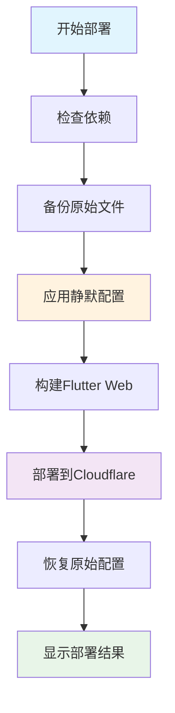

# 🔇 云助通Web端 - 完整静默系统

## 🎯 核心功能

**一键静默部署** - 实现Web端完全无控制台输出的专业生产环境

### ⚡ 快速开始
```bash
# 最简单的一键部署
./deploy-silent.sh
```

## 🏗️ 系统架构

### 📁 文件结构
```
meeting_pro/
├── 🚀 部署脚本
│   ├── deploy-silent.sh      # 一键静默部署（推荐）
│   ├── deploy.sh             # 快捷方式
│   ├── deploy-pages.sh       # 传统部署（显示日志）
│   └── build-silent.sh       # 仅构建静默版
│
├── 🔇 静默组件
│   ├── web/sw-silent.js      # 静默版Service Worker
│   ├── web/console-silence.js # 控制台静默脚本
│   └── lib/utils/logger.dart  # 条件日志工具
│
├── ⚙️ 配置文件
│   ├── wrangler.toml         # Cloudflare Pages配置
│   ├── _routes.json          # SPA路由支持
│   └── package.json          # NPM脚本管理
│
└── 📖 文档指南
    ├── DEPLOY_GUIDE.md       # 一键部署指南
    ├── WEB_LOGGING_CONFIG.md # 日志配置说明
    └── CLOUDFLARE_DEPLOY.md  # Cloudflare部署详解
```

### 🔄 工作流程

#### 1. 一键静默部署流程


#### 2. 静默机制层次


## 🔇 静默技术实现

### 1. HTML层面
```html
<!-- 控制台静默脚本最优先加载 -->
<script src="console-silence.js"></script>
```

### 2. JavaScript层面
```javascript
// 生产环境自动覆盖所有console方法
if (!isDev) {
  console.log = function() {};
  console.error = function() {};
  // ... 覆盖所有console方法
}
```

### 3. Dart层面
```dart
// 条件日志工具
class Logger {
  static bool _isWebLoggingEnabled = false; // Web端默认静默
  
  static void log(String message) {
    if (_shouldLog) {
      print(message); // 仅在满足条件时打印
    }
  }
}
```

### 4. Service Worker层面
```javascript
// 静默版Service Worker - 移除所有console输出
// 所有操作静默处理，无任何日志
```

## 📊 功能对比

| 特性 | 静默部署 | 传统部署 | 本地开发 |
|------|----------|----------|----------|
| **控制台输出** | 🔇 完全静默 | 📝 显示日志 | 📝 显示日志 |
| **用户体验** | ✅ 专业干净 | ⚠️ 开发向 | ⚠️ 开发向 |
| **部署速度** | ⚡ 快速 | ⚡ 快速 | - |
| **自动恢复** | ✅ 自动 | ❌ 手动 | - |
| **错误处理** | 🔇 静默 | 📝 显示 | 📝 显示 |
| **适用场景** | 🌐 生产环境 | 🧪 测试环境 | 💻 开发环境 |

## 🛠️ 使用方法

### 🚀 部署命令
```bash
# 方式1: 一键静默部署（最推荐）
./deploy-silent.sh

# 方式2: 快捷命令
./deploy.sh

# 方式3: NPM脚本
npm run deploy:silent
npm run deploy:quick

# 方式4: 传统部署（显示日志）
./deploy-pages.sh
npm run deploy
```

### 🔧 构建命令
```bash
# 静默构建（不部署）
./build-silent.sh
npm run build:silent

# 普通构建
flutter build web --release
npm run build
```

### 📊 管理命令
```bash
# 查看部署状态
npm run status

# 查看实时日志
npm run logs

# 清理构建文件
npm run clean
```

## 🎯 部署后验证

### ✅ 检查静默效果
1. 访问部署的应用
2. 打开浏览器开发者工具
3. 查看Console标签
4. **应该看到完全干净的控制台**

### ✅ 检查功能完整性
- 🔄 应用正常加载
- 🖱️ 交互功能正常
- 📱 响应式设计正常
- 🔐 安全策略生效

## 🔍 故障排除

### Q: 部署失败怎么办？
```bash
# 脚本会自动恢复原始配置，但如果没有：
cp web/sw-debug.js.bak web/sw.js
rm web/sw-debug.js.bak
```

### Q: 需要在生产环境调试？
```bash
# 在浏览器控制台运行：
window.__restoreConsole()
```

### Q: 本地开发看不到日志？
```dart
// 在main.dart中手动启用：
Logger.enableWebLogging(true);
```

## 🌟 核心优势

### ✅ 对用户
- **专业体验** - 无杂乱的开发者信息
- **加载更快** - 无日志输出开销
- **界面干净** - 无控制台警告和错误

### ✅ 对开发者
- **一键部署** - 无需复杂配置
- **自动恢复** - 部署后可继续开发
- **灵活调试** - 需要时可恢复日志

### ✅ 对运维
- **安全性高** - 不暴露敏感信息
- **性能更好** - 减少日志开销
- **维护简单** - 标准化部署流程

## 🎉 总结

这套**完整静默系统**实现了：

1. **🔇 三层静默**
   - HTML/JS层控制台静默
   - Dart层条件日志
   - Service Worker静默

2. **🚀 一键部署**
   - 自动备份和恢复
   - 智能环境检测
   - 错误处理和回滚

3. **📱 生产就绪**
   - Cloudflare Pages CDN
   - 全球加速和SSL
   - 专业用户体验

**现在你可以通过一个命令，将Web应用部署到全球CDN，并确保用户看到完全专业、无杂乱信息的界面！**

```bash
./deploy-silent.sh
```

🎯 **让你的Web应用保持静默、专业、高效！** 